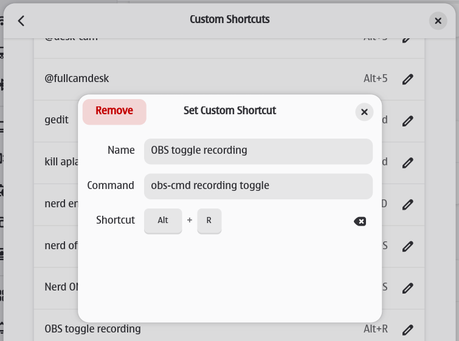

# obs-cmd

**obs-cmd** is a lightweight, command-line interface for controlling OBS Studio via the obs-websocket v5 protocol. It provides a simple and efficient way to automate your streaming and recording workflows.

[](https://github.com/grigio/obs-cmd/actions/workflows/release.yml)
[](https://deps.rs/repo/github/grigio/obs-cmd)

## Features

- **Scene Management**: Switch between scenes, get current scene, manage scene collections
- **Recording Control**: Start, stop, pause, resume recording with status monitoring
- **Streaming Control**: Start, stop, toggle streaming with status checking
- **Source Control**: Toggle filters, mute/unmute audio sources, show/hide scene items
- **Virtual Camera**: Start, stop, toggle virtual camera output
- **Replay Buffer**: Manage replay buffer with save functionality and status tracking
- **Media Inputs**: Full media control with play, pause, stop, restart, and seek capabilities
- **Screenshots**: Capture source screenshots with custom dimensions and compression
- **Hotkeys**: Trigger any OBS hotkey by name
- **Projectors**: Open fullscreen and source-specific projectors on multiple monitors
- **System Info**: Get OBS Studio version and connection information
- **Shell Completion**: Auto-completion support for bash, zsh, fish, and other shells

## Installation

### Binaries

You can download the latest pre-compiled binaries for your operating system from the [Releases](https://github.com/grigio/obs-cmd/releases/latest) page.

**Linux/macOS:**
```bash
# Download and extract the appropriate binary for your system
curl -L https://github.com/grigio/obs-cmd/releases/latest/download/obs-cmd-x64-linux.tar.gz | tar xz
chmod +x obs-cmd
sudo mv obs-cmd /usr/local/bin/
```

### From Source

Ensure you have [Rust](https://www.rust-lang.org/tools/install) installed, then run the following commands:

```bash
git clone https://github.com/grigio/obs-cmd.git
cd obs-cmd
cargo install --path .
```

### Arch Linux

`obs-cmd` is available on the Arch User Repository (AUR). You can install it using an AUR helper like `yay`:

```bash
yay -S obs-cmd
```

### Gentoo Linux

`media-video/obs-cmd` is available on [Project:GURU](https://wiki.gentoo.org/wiki/Project:GURU/Information_for_End_Users).

```bash
sudo emerge -av media-video/obs-cmd
```

## Usage

`obs-cmd` connects to the OBS WebSocket server. By default, it attempts to connect to `obsws://localhost:4455` with the password `secret`. You can configure the WebSocket settings in OBS under **Tools → WebSocket Server Settings**.

To override the default connection settings, you can use the `--websocket` flag or set the `OBS_WEBSOCKET_URL` environment variable:

```bash
# Using the --websocket flag
obs-cmd --websocket obsws://<hostname>:<port>/<password> <command>

# Using an environment variable
export OBS_WEBSOCKET_URL=obsws://<hostname>:<port>/<password>
obs-cmd <command>
```

### Commands Reference

#### Scene Management
```bash
# Get current scene
obs-cmd scene current

# Switch to a scene
obs-cmd scene switch "Scene Name"

# Switch scene collection
obs-cmd scene-collection switch "Collection Name"
```

#### Recording Control
```bash
# Start/stop/toggle recording
obs-cmd recording start
obs-cmd recording stop
obs-cmd recording toggle

# Pause/resume recording
obs-cmd recording pause
obs-cmd recording resume
obs-cmd recording toggle-pause

# Check recording status
obs-cmd recording status
obs-cmd recording status-active
```

#### Streaming Control
```bash
# Start/stop/toggle streaming
obs-cmd streaming start
obs-cmd streaming stop
obs-cmd streaming toggle

# Check streaming status
obs-cmd streaming status
```

#### Virtual Camera
```bash
# Start/stop/toggle virtual camera
obs-cmd virtual-camera start
obs-cmd virtual-camera stop
obs-cmd virtual-camera toggle
```

#### Replay Buffer
```bash
# Start/stop/toggle replay buffer
obs-cmd replay start
obs-cmd replay stop
obs-cmd replay toggle

# Save last replay
obs-cmd replay save

# Get last replay path
obs-cmd replay last-replay

# Check replay buffer status
obs-cmd replay status
```

#### Audio Control
```bash
# Toggle mute state
obs-cmd audio toggle "Mic/Aux"

# Mute/unmute audio devices
obs-cmd audio mute "Desktop Audio"
obs-cmd audio unmute "Mic/Aux"

# Check audio device status
obs-cmd audio status "Mic/Aux"
```

#### Filter Management
```bash
# Enable/disable filter
obs-cmd filter enable "Source Name" "Filter Name"
obs-cmd filter disable "Source Name" "Filter Name"
obs-cmd filter toggle "Source Name" "Filter Name"
```

#### Scene Items
```bash
# Enable/disable scene items (show/hide)
obs-cmd scene-item enable "Scene Name" "Source Name"
obs-cmd scene-item disable "Scene Name" "Source Name"
obs-cmd scene-item toggle "Scene Name" "Source Name"
```

#### Media Input Control
```bash
# Play/pause/stop/restart media
obs-cmd media-input play "Media Source"
obs-cmd media-input pause "Media Source"
obs-cmd media-input stop "Media Source"
obs-cmd media-input restart "Media Source"

# Set cursor position (format: [hh:]mm:ss)
obs-cmd media-input set-cursor "Media Source" "00:30"
obs-cmd media-input set-cursor "Media Source" "1:23:45"
```

#### Screenshots
```bash
# Save source screenshot
obs-cmd save-screenshot "Webcam" "png" "/path/to/screenshot.png"

# With custom dimensions
obs-cmd save-screenshot "Display Capture" "jpg" "/path/to/screenshot.jpg" --width 1920 --height 1080

# With compression quality (for JPEG)
obs-cmd save-screenshot "Source" "jpg" "/path/to/screenshot.jpg" --compression-quality 90
```

#### Projectors
```bash
# Open fullscreen projector on specific monitor
obs-cmd fullscreen-projector --monitor-index 1

# Open source projector on specific monitor
obs-cmd source-projector "Webcam" --monitor-index 2
```

#### Hotkeys
```bash
# Trigger hotkey by name (check OBS Settings → Hotkeys for exact names)
obs-cmd trigger-hotkey "OBSBasic.StartRecording"
obs-cmd trigger-hotkey "OBSBasic.StopRecording"

# Audio mute/unmute hotkeys
obs-cmd trigger-hotkey "libobs.mute"
obs-cmd trigger-hotkey "libobs.unmute"

# Note: Hotkey functionality comes as-is and may not be reliable
# For most operations, use specific commands like 'recording start' instead
```

#### System Information
```bash
# Get OBS Studio version and info
obs-cmd info
```

#### Shell Completion
`obs-cmd` supports auto-completion for major shells. Generate completion scripts:

```bash
# Bash completion
obs-cmd completion bash > ~/.local/share/bash-completion/completions/obs-cmd
source ~/.local/share/bash-completion/completions/obs-cmd

# Zsh completion
obs-cmd completion zsh > ~/.zsh/completions/_obs-cmd
echo 'fpath+=~/.zsh/completions' >> ~/.zshrc
autoload -U compinit && compinit

# Fish completion
obs-cmd completion fish > ~/.config/fish/completions/obs-cmd.fish

# PowerShell completion
obs-cmd completion powershell | Out-File -Encoding utf8 $PROFILE
```

After setting up completion, you can use `Tab` to auto-complete commands:
```bash
obs-cmd rec<Tab>        # Completes to "recording"
obs-cmd scene sw<Tab>   # Completes to "scene switch"
```

### Integration Examples

#### Linux/GNOME Shortcuts
Map `obs-cmd` commands as global keyboard shortcuts in GNOME Settings:

```bash
# Examples for custom shortcuts:
# obs-cmd recording start
# obs-cmd scene switch "Live"
# obs-cmd streaming toggle
```

#### Stream Deck Integration
Use `obs-cmd` with Stream Deck software for one-touch OBS control:
- Add "System: Open" action
- Point to obs-cmd executable with desired command
- Example: `/usr/local/bin/obs-cmd recording toggle`

#### Scripting Examples
```bash
# Bash script for stream start sequence
#!/bin/bash
obs-cmd scene switch "Starting Soon"
sleep 5
obs-cmd streaming start
sleep 2
obs-cmd scene switch "Live"

```



## Linux Packages

[](https://repology.org/project/obs-cmd/versions)


## Requirements

- **OBS Studio** 28.0+ with obs-websocket v5 plugin
- **WebSocket Server** enabled in OBS (Tools → WebSocket Server Settings)
- Default connection: `obsws://localhost:4455` with password `secret`

## Troubleshooting

### Connection Issues
```bash
# Test connection
obs-cmd info

# Check if OBS WebSocket is running
# In OBS: Tools → WebSocket Server Settings → Enable WebSocket Server
```

### Common Errors
- **Connection refused**: Ensure OBS WebSocket server is running
- **Authentication failed**: Check password in OBS WebSocket settings
- **Invalid URL format**: Use `obsws://hostname:port/password` format

### Debug Mode
Set environment variable for verbose output:
```bash
RUST_LOG=debug obs-cmd info
```

## Development

```bash
# Build from source
cargo build --release

# Run tests
cargo test

# Format code
cargo fmt

# Lint code
cargo clippy -- -D warnings
```

## Donations

If you find this project helpful, please consider making a donation to support its development.

- **Monero**: `88LyqYXn4LdCVDtPWKuton9hJwbo8ZduNEGuARHGdeSJ79BBYWGpMQR8VGWxGDKtTLLM6E9MJm8RvW9VMUgCcSXu19L9FSv`
- **Bitcoin**: `bc1q6mh77hfv8x8pa0clzskw6ndysujmr78j6se025`
